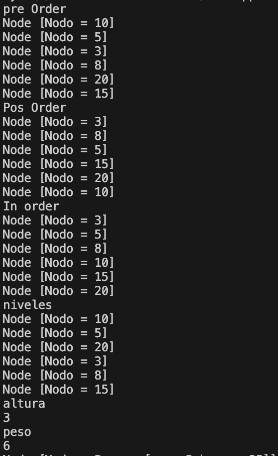
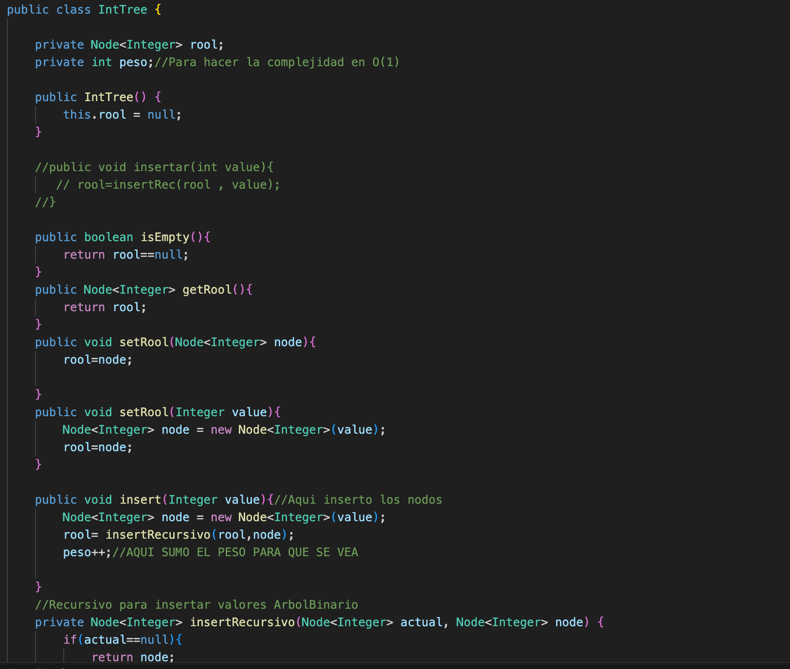
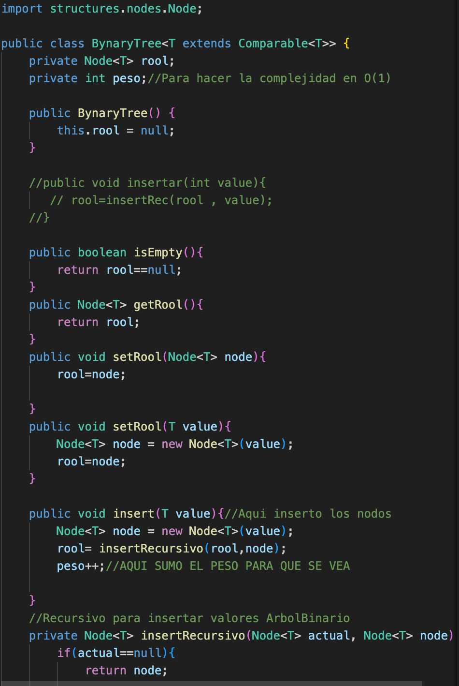
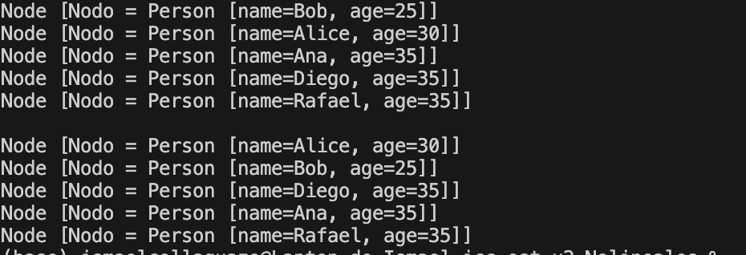

# Práctica: Estructuras Dinámicas Lineales

## Datos del Estudiante
- **Nombre:** Bryam Collaguazo
- **Curso:** Grupo 3
- **Fecha:** 10/06/2026

---
**Descripción General de el Proyecto:**
En este proyecto vamos a realizar dos ejercicios para generar un arbol y ver el orden dependiendo de como seria con el pre orden,In orden,Altura entre otros, uno seria con valores y otron con nombres y edades.

## Ejercicio 01 : Arbol binario de busqueda

**Descripción:**
En este ejercicio creamos un arbol binario donde guardamos numeros enteros.etse ejercicios hace que los valores se vayan los menores a la derecha y los mayores a la izquiera, en el cual gracias a eso podremos calcular su altura, su anchura, su pre orden entre otros 

## Ejercicio 02 :  Arbol binario generico

**Descripción:**
En este ejercicio llegamos a crear un arbol que es generico.Esto quiere decir que no solo nos va a permitir almacenar numeros, si no culaquier tipo de dato entre esos nombres y edades, En este caso las personas se ordenan por dos cosas por las edades y si tienen la misma edad despues van por los nombres

### Captura de salidas en consola
## Ejercicio 1 :

## Ejercicio 2 :

### Captura del código de implementación de los ejercicios 
## Ejercicio 1 :

## Ejercicio 2 :

### Tabla de evidencias requeridas

| Ejercicio | Evidencias de código | Evidencias de consola | Observación |
| :--- | :---: | :---: | :--- |
| Ejercicio 01: Arbol binario de busqueda||  |El codigo llega a funcionar correctamente de forma que podemos medir su altura,ancgura y ver su pre orden e inorden, este funciona ordenando a la derecha los mayores y a la izquiera los menores |
| Ejercicio 02: Arbol binario generico |  |  | Se llego a implementar de forma correcta una logica que seria generica el cual nos permitio ordenar por asi decirlo a las personas por su nombre y su edad con un metodo implementado.|
## Explicacion sobre la nueva clase del 24/06/2026
## Creamos un metodo llamada contruirHasSets
El cual no permite como primer punto elementos duplicados y no llega a garantizar el orden de los elementos, en este se repetia una letra que era la A y como en este no se puede contener elementos duplicados el hasset ignora la repetira porque tecnincamente ya esta impresa, y imprime en cualquier orden.
## Creamos un metodo llamado contruirLinkedHashSets
En este caso es similar este no permite elementos duplicados pero si garantiza el orden de los elementos de pendiendo de su valor o si es por letras el valor del codigo ascci para poder ordenarlas y compararlas.
## Creamos un metodo llamado contruirTreeSets
En este primero no permite elementos duplicados y mntiene los elementos ordenados, pero si existen palabras o valores repetidas las ignora por completo y no las imprime solo imprime las primeras que salen ignorando por completo las otras.Tienen un orden programable

## Explicacion clase De mapas 25/06/2026

## Creamos un metodo llamado construirHashMap
El cual se utilizó para guardar claves y valores, en donde no es necesario que tenga un orden especifico, cuando se intenta insertar una clave ya existente simplemente la  actualiza y la va sobreescribiendi
## Creacion de un contruirLinkedHashMap
para este se llego a utuliza para guardar claves y valores pero el detalle de este es que va guardando el orden de como fuero llegando o entrando los datos para reflejarlo en la Salida
## Creacion de cTreeMap
Para este se ocupo un tree map el cual simplmente garantiza un orden alfebetico y no permite duplicados de tal manera que si existe un mismo valor simplemente lo ignora y lo lo deja entrar.

## Explicacion de la clase Graphos
Fecha 01/07/2026

En esta practica empezamos a programar con grafos en los cuales utilizamos Map y sets para poder hacer sus metodos agregar el cual recibio como parametros el T y la guardamos en una varible, despues instanciamos un nodo para ir agregando en dicho caso que no existan, con el putIfAbsent se iba comparando su era true o false de si existia el grafo y lo iba agredando en tal caso que no existiera, despues con el metodo addEdge este iba a generar las uniones entre los grafos en la cual instanciamos un nodo de tipo t en el cual que se iba a guardar en la varible nv1 y asi creamos otra con el nv2, haciamos una comparacion para ver si eran iguales pero ya no entre nodos si no entre los nodos del valor de las personas por lo que fuimos al metodo nodo y le hicimos retornar en su hatset el valor del nodo persona oara que asi vayamos agregando las conexiones, y tambien hicimos el metodo para unir una sola vez que es lo mismo que el de dos.

## Salida de consola

## Explicacion de la clase de 08/07/2026
Lo que hicimos aqui fue crear un codigo el cual nos servia para que vaya visitando cada nodo hasta encontrar un camino hacia el que buscamos, y en tal caso de no encontrarlo devolvia que no se econtró el nodo, lo implementamos con interfaz la cual No contiene logica interna, Define los metodos, No se puede instanciar,  Estructura de metodo, el objetivo de mi sistema es encontrar una rutaDefine una accion, la accion define el resultado
## Este es el codigo que desarrollamos
public class DFSPathFinder<T> implements PathFinder<T> {

    @Override
    public PathResult<T> find(Graph<T> graph, T start, T end) {
        Set<T> visited = new LinkedHashSet<>();
        Set<T> path= new LinkedHashSet<>();

        boolean encontrado= dfs(graph,start,end,visited,path);
        
                if(!encontrado){
                    path.clear();
                }
                return new PathResult<>(visited, path);//Visitados y la ruta
        
            }
        
            private boolean dfs(Graph<T> graph, T current, T end, Set<T> visited, Set<T> path) {
                visited.add(current);
                path.add(current);

                //Caso base
                Node<T> nC= new Node<T>(current);
                Node<T> nE= new Node<T>(end);
                if(nC.equals(nE)){
                    return true;

                }
                for(Node<T> vecino: graph.getVecinos(current)){
                    if(!visited.contains(vecino.getValue())){
                        boolean encon=dfs(graph,vecino.getValue(),end,visited,path);
                        if(encon){
                            return true;

                        }
                    }
                }
                path.remove(current);

                return false;
            }

El algortimo implementado fue DFS, creamos dos linkedHasset uno que se llama visited para llevar un registro de todos los nodos visitados, y un path para ir registrando el camino de los nodos,despues llama al metodo bfs y va diciendo que si ya finalizó la busqueda y no encontró nada limpie el camino de los nodos y retorna el resultado y las rutas,
Despues añade a los metodos current a los conjuntos path y visited, despues en el caso base dice si el nodo inicial es igual al nodo final y retorna un true asi indica que un camino hacia el nodo buscado si existe.
despues recorre todos los vecinos del nodo actual, despues si un vecino nno llega a ser recorrido llega a reaizar una llmada recursiva con el dfs. en tal caso que el dfs llega a dar true significa que el camino ha sido encontrado y regresa.
Despues utulizamos un backTraquing el cual nos ayuda a que si el nodo no fue encontrado elimina la ruta del nodo actual ya que ese camino no fue el indicado.

## Conclusiones

El estudiante debe redactar al menos tres conclusiones propias relacionadas con el uso de pilas y colas.

- Conclusión 1:
En conclusion puedo decir que los Arboles binarios llegan a ser muy utilies ya que organizan la informacion que reciben de forma instantanea, lo cual nos permite meter datos y e arbol decide para que lado mandar, lo que llega a ser muy beneficiosos ya que nos permite encontrar datos o ordenar de forma rapida

- Conclusión 2:
En conclusion puedo decir que la recursividad es una herramienta  muy util ya que las operaciones como ver su anchura, altura, (pre orden, pos orden , inOrden) perimitiendo que su codigo sea mas facil y poder revisar sus sub arboles

- Conclusión 3: 
En concluision el tipo de datos genericos implemtentados que se llegana combinar con la interfaz, este nos permite crear un codigo que sea reutilizable. Gracias a esto una misma estructura de arbol nos permite guardar mas objetos.

