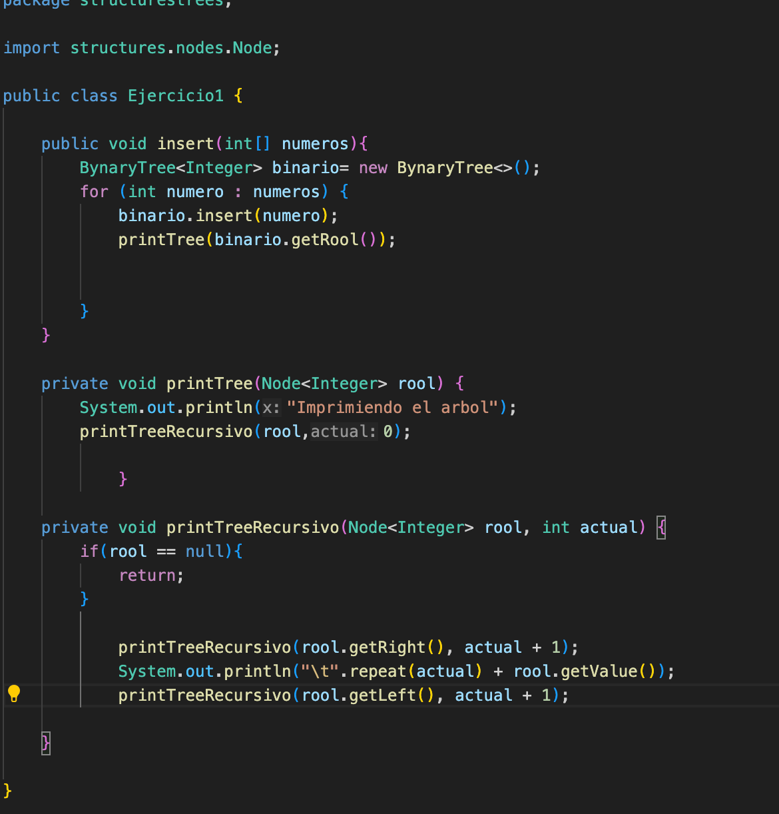
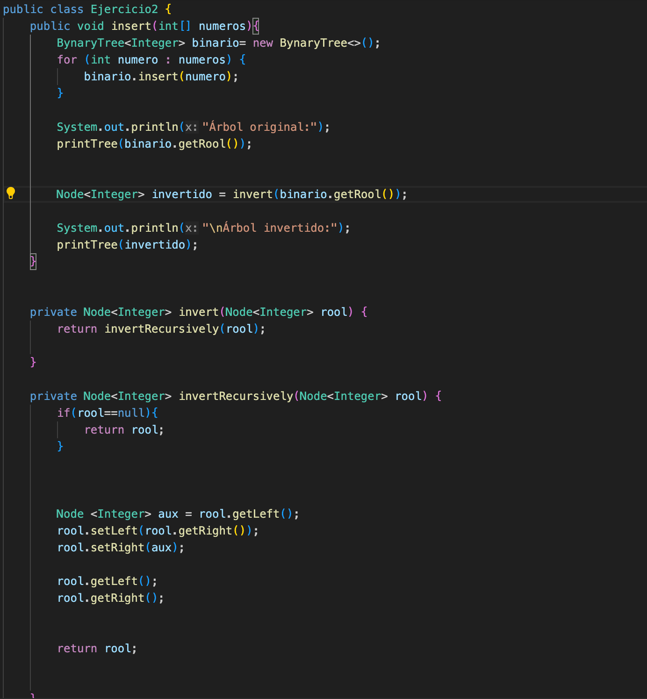
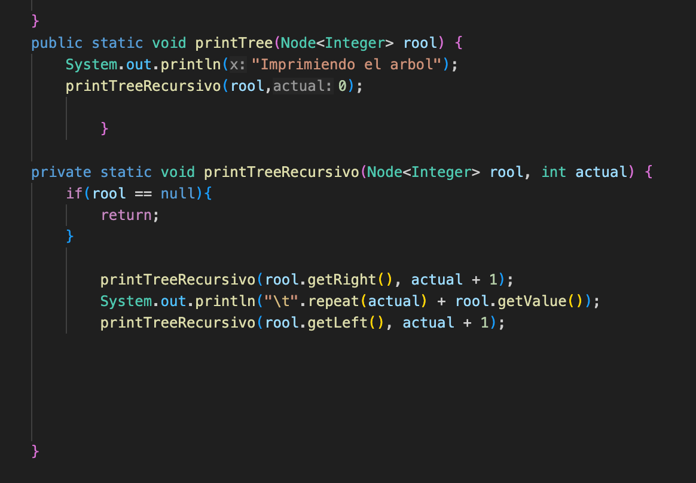
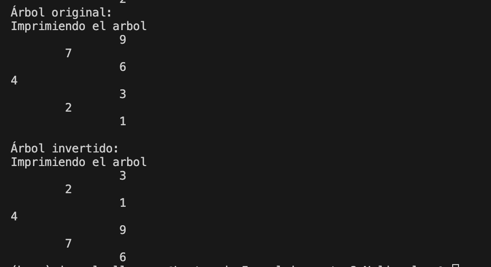
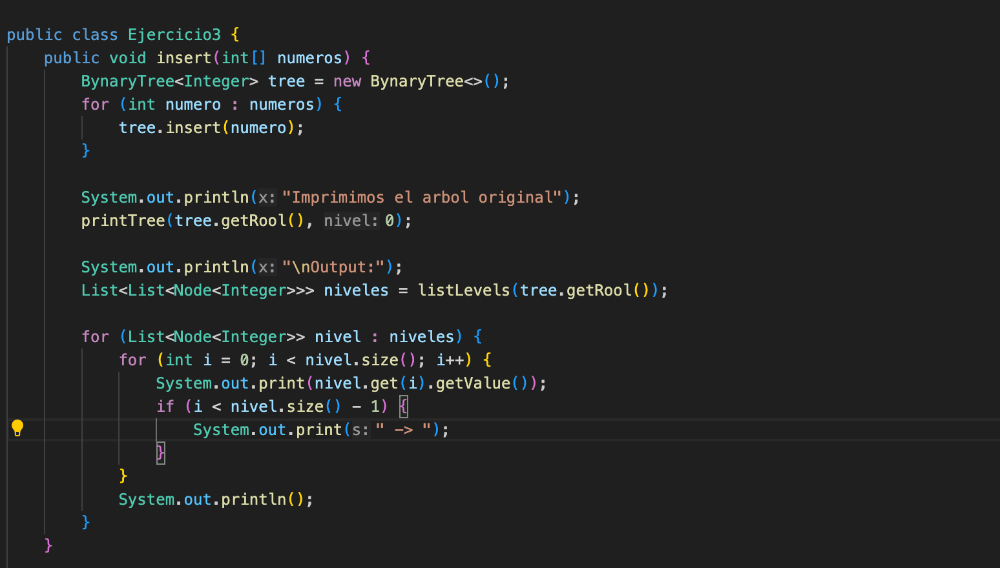
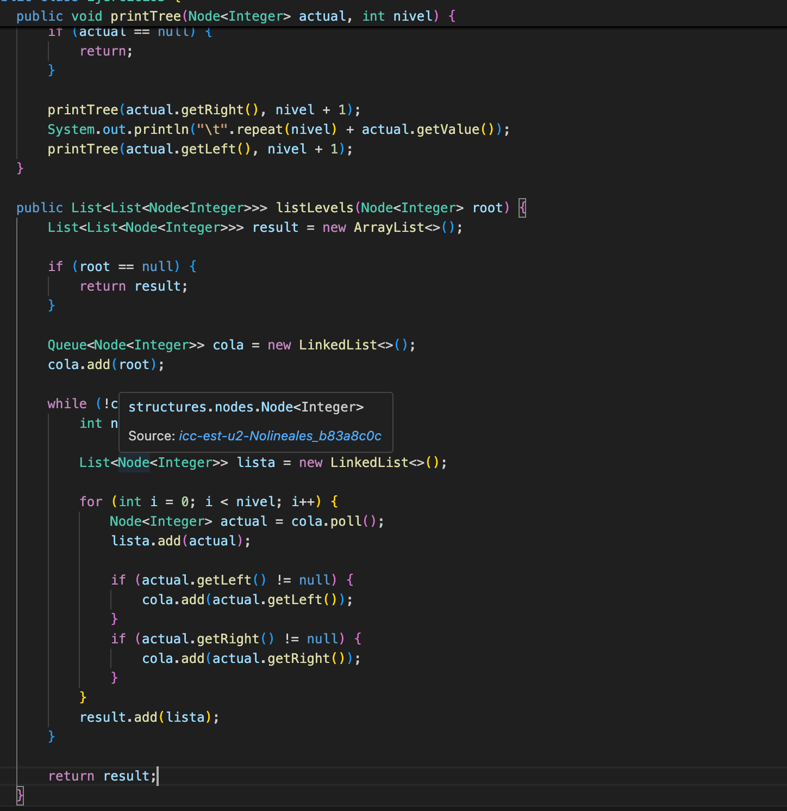
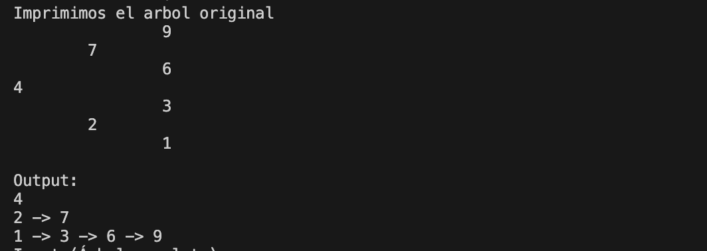
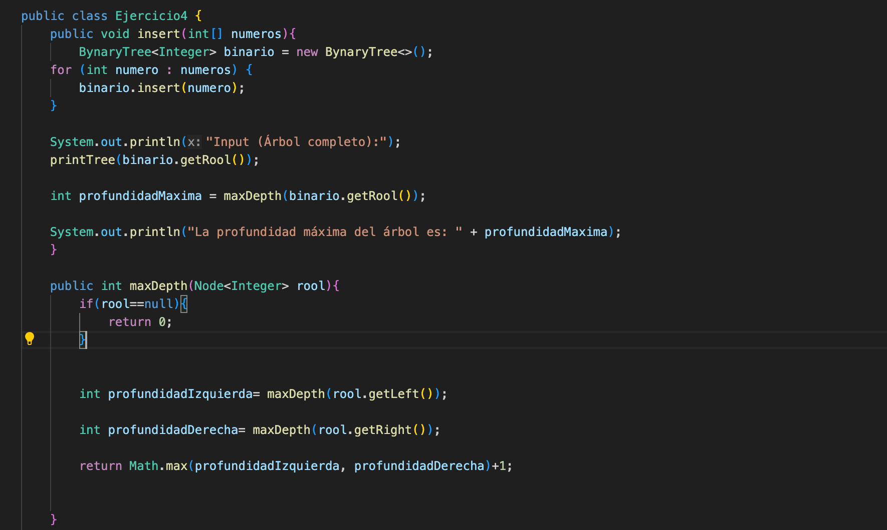
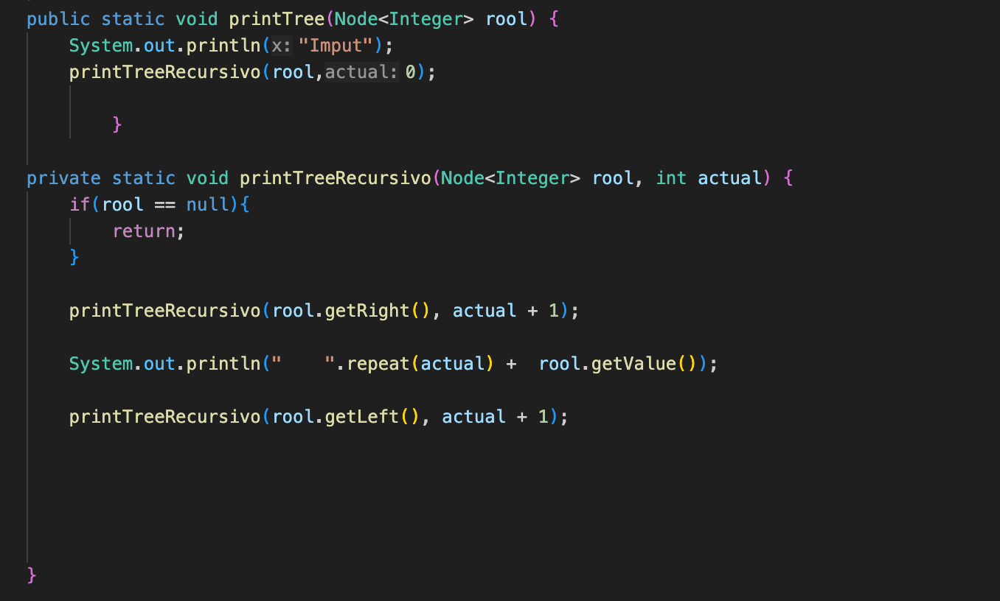
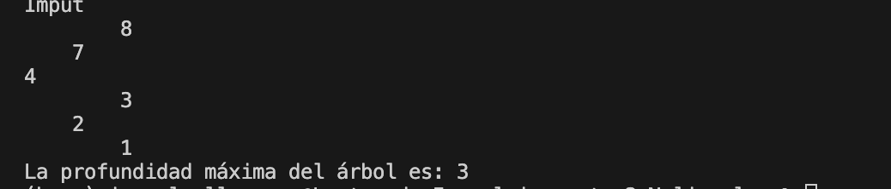

## Informe
## Nombre:
Bryam Collaguazo
## Fecha:
22/06/2026
## Ejercicio 1
## Insercion de un Bta y impresion de la consola de manera vertical

## Descripcion Insert
El metodo insert permite llegar a crear un arbol nuevo y despues con los numeros que le dimos en el main va insertando uno por uno en las posiciones adecuadas para mostarlo en consola
## Descripcion del printTreeRecursivo
El metodo de printTree generalmente es como la base de donde empieza el arbol es el quien sabe a donde mandar cada elemento generado, es el que va a llamar al metodo recursivo para ir ubicando los elementos y imprimiendolos, el metodo printRecursivo
empieza con el caso base de que si el la raiz es igual a un null va a retornar la misma raiz, despues lo que hace es va a la derecha del arbol verifica si tiene hijos, como bajo tiene que sumar uno al nivel y imprime ese nodo con una tabulacion, y hace lo mismo con la izquierda, llega a regresar a la raiz y despues baja a la izquierda y se suma uno al nivel y va verificando y imprime el valor de la izquierda con su tabulacion.
## Salida de consola 

## Ejercicio 2
## Insercion con Inversion de un arbol Binario

## Descripcion
El metodo insert va insertando numero por numero de los valores que le dimos en el arbol, despues imprime el arreglo orginal y despues  creammos una varibale invertido el cual va a guardar al metodo va a llamar el metodo invert el cual por consiguiente tambien llame al metodo invert recuersivo va intercambiado a sus hijos y muestra el proceso invertido,

## Inver y invertRecursivo

en el invert recuersivo lo uno que hacemos es retornar en invertRecursivo con su raiz principal, y esta llama directamente al metodo recursivo, despues tenemos en mietodo invertRecursivo el cual genera una caso baso que si su raiz es igual a null returna su misma raiz, despues crea una varibale auxiliar de tipo Nodo para guardar el valor que esta a la izquiera, despues como esa izquiera queda vacia lo que hacemos es meter el valor que estaba a la derecha, y despues como esa derecha queda vacia metemos el auxiliar que como habiamos dicho guardaba el valor de la izquierda entonces mete ese valor a la derecha, desoues solo llamammos a la izquierda y a la derecha con sus nuevos valores y retornamos su raiz.
## Print tree y printTree recursivo
El print es el que directamente va a saber donde ubicar cada elemento, para imprimirlo, dependiendo de el metodo recursivo.
el metodo printTreeRecursivo valida que la raiz no sea nula, una vez que valida eso va recorriendo el lado derecho y baja y la va sumando uno al nivel y va imprimendo el valor que esta ahi, y asi hace lo mismo con el de la izquierda una vez que acabo con el de la derecha.

## Salida de consola 

## Ejercicio 3
Listar niveles
## Codigo

## Descripcion del insert
El metodo insert lo unico que hace es recibir un arreglo de numeros enteros, en la cual tambien crea una instancia de un arbol vacio, despues en ese arbol se va recorriendo y añadiendo dato por dato de los numeros recibidos, despues imprime el mesaje y despues llama al metodo printtree para mostar al arbol original, despues se llega a llama a listLevel y la guardamos en una varible llamada nivel para crear una lista donde cada nodo tenga un valor, despues creamos dos for lo cual solo nos ayuda a ir nivel por nivel para que se vaya recorriendo el arbol y se muestre los valores.
## Descripcion del printree
lo que hace el print tree es verificar si la iaz actual es igual a nulo y si no es retorna un null, despues utiliza recursividad para que se imprima la derecha y como esta a la derecha le suma uno para que el nivel de ese crezca y pueda imprimir el siguiente y despues vuelve a la raiz imprime esa raiz y va por la izquierda y hace lo mismo imprime el numero del nodo que esta ahi y ya, y eso causa el efecto de la verticalidad

## Descripcion para ListLevents
primero creamos una varibale resultado que ira guradando nivel por nivel, despues vamos al caso basi de que si la raiz es igual a null retorna el resultado ose el nivel, despues vamos a crear una colar que se va a guardar en una varible llamada cola que va a guardar la raiz introducida en el arbol, Despues creamos un while va cerificando si la cola no esta vacia va haciendo todo lo de adentro del while, desues creamos una varible que va a ir guradando los nodos de cada nivel, despues creamos una lista temporal que ira almacenando los valores que vayamos teniendo, despues con el for vamos recorriendo nodo por nodo que esta guardado en la variable nivel, despues creamos una varible llamada actual en la cual guardamos la extraxion de cada nodo en la cola y la vamos añadiendo a la lista temporal, despues hacemos una comparacion con el if para saber si el elemento que esta a la derecha no es nulo y lo vamos añadiendo a la lista, y es lo mismo con el de la izquierda, y por ultimo retornamos esa lista.
## Salida de consola

## Ejercicio 4
Profundidad máxima 
## Captura codigo

## Descripcion del insert
Recibe el arreglo de umeros enteros que dios y va añadiendo en la instancia del arbol vacio que creamos por la recorrida que se da por el for va añadiendo valor por valor, Despues llamamos a nuestro printTree que es el que tiene el arbol orginal para imprimirlo, despues en una variable prufundidad maxima de tipo entero gurdamos el valor de profundadidad que consiguio el maxDepth y luego lo imprimimos

## Descripcion del MaxDepth 
primero vamos nuestro caso vase y verificamos que nuestro valor no sea nulo, despues en una varible profundidadIzquierda guardamos a los valores de la izquierda y lo mismo pasa con el de la izquierda guardamos en una varible, despues retornamos el valor calculando el maximo valor que se encontro entre la pronfundidad de de la izquierda y de la derecha y le sumamos uno y con eso obtenemos nuestro valor
## Descripcion del print tree y el recursivo
Con el print tree imprimimos el arbol, despues llamamos al metodo printTreeRecurivo para tener todo lo que se hace en ese metodo, en el preent Tree recursivo hacemos nuestro caso base para saber si es nulo y despues va por la derecha y va sumandole uno a su nivel envase a como va recorriendo los nodos, despues imprime y hace lo mismo con la izquierda
## Salida de consola

| Ejercicio | Evidencia de código | Evidencia de consola | Observación |
|----------|---------------------|----------------------|-------------|
| Ejercicio 01: Insertar en BST |  |  |Es un ejercicio que relamente ayuda a desarrollar la logica para poder poner el arbol de forma vertical y imprimir la raiz y sus hijos y nodos |
| Ejercicio 02: Invertir árbol binario | |  | En este segundo codigo podemos ver que el arbol lo podemos invertier creando un auxiliar para guardar una varible y irle poniendo para que el que esta a la derecha se pase a la izquierda y viceversa y despues solo lo imprimimos.|
| Ejercicio 03: Listar niveles ||  | Es un ejercicio mas complejo ya que nos obilgo a crear bucles para poder mostar nivel por nivel y los hijos que tenian para poder mostrarlos en consola|
| Ejercicio 04: Profundidad máxima |  | | Este ejercicio no es tan dificil ya que el momento de intentar averiguar la profundidad solo tenemos que guardar en varubles los nodos de la derecha y izquierda y utilizar el metodo Math max para calcular su maximo y sumarle para que nos de su prufundidad |

